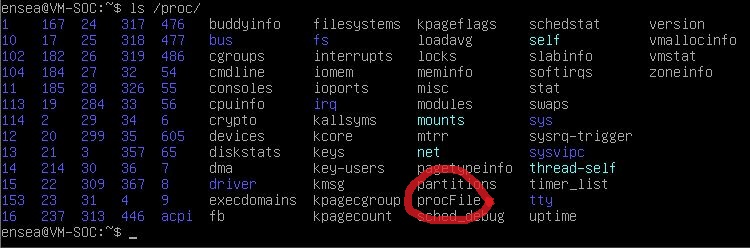
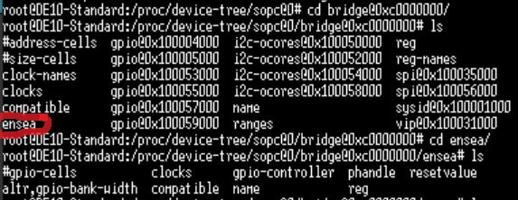

# TP1 - Prise en main
## Connexion au système
Une fois connecté au SoC et après avoir tapé ces commandes suivantes : 
```
./expand_rootfs.sh
./resize2fs_once
```
Nous passons d'un espace de 3 GO à 15 GO disponibles.
## Exploration des dossiers /sys/class et /proc
- /sys/class/leds/fpga_ledX/ donne accès aux contrôles des LED de la FPGA
- /proc/ioport fournit des informations sur les adresses entrées/sorties des périphériques
- /proc/iomem contient les informations des adresses mémoires
- /proc/device-tree/sopc@0
## Compilation croisée

Cette commande, ```arm-linux-gnueabihf-gcc hello.c -o hello.o```, permet de faire de la cross-compilation.

./hello.c ne s'exécute pas car il s'agit d'un fichier binaire que la VM ne peut pas exécuter, il faut passer par la carte VEEK.
## Accès au matériel (echo) et chenillard

```echo "1" > /sys/class/leds/fpga_led1/brightness``` allume la led à la position 1 simplement

Nous allons mettre en place un chenillard en s'inspirant de la ligne de commande d'au dessus *cf* _TP1_/_chenillard.c_ et son exécutable. </br>
Nous ouvrons les fichiers ```/sys/class/leds/fpga_ledx/brightness``` où ```x``` représente le numéro de led et est remplacé puis nous écrivons dans la valeur de la led afin de l'allumer et l'éteindre.

# TP2 - Modules kernel
## Accès aux registres
*cf* _TP2_/_mmap_/_mmap.c_
## Compilation de module noyau sur la VM
Les programmes suivants :
- utilisation de paramètres au chargement du module
- création d’un entrée dans /proc
- utilisation d’un timer </br>
sont assemblés en un seul programme *cf* _TP2_/_proc_/_proc.c_ par conséquent son programme est *cf* _TP2_/_proc_/_proc.ko_

## Récupération de la configuration actuelle du noyau
```
export CROSS_COMPILE=<chemin_arm-linux-gnueabihf->
export ARCH=arm
make prepare
make scripts
```
```export``` permet de définir des variables d'environnement qui peuvent être utilisées par les processus en cours d'exécution
Le <chemin_arm-linux-gnueabihf> est le chemin noté plus haut sans le gcc final. 
Par exemple : /usr/bin/arm-linux-gnueabihf-
— Pourquoi le chemin fini par un tiret "-" ? Il n'est pas nécessaire d'ajouter le gcc puisqu'il sera complété lorsque ```make``` sera appelé après les exports.
## Chargez les modules dans la carte VEEK
Pour charger les modules suivants dans la VEEK
— utilisation de paramètres au chargement du module
— création d’un entrée dans /proc
— utilisation d’un timer
il faut ajouter la ligne ```CFLAGS_MODULE=-fno-pic``` dans le Makefile et aussi modifier le chemin du noyau.
Il faut également sortir du dossier partagé ```~/src``` car le make ne compile pas proprement lorsque ce dossier est partagé avec Windows.
# TP3 - Device tree
## Changement du device tree (ensea)

## Module accedant au LED via /dev
Les fonctions :
- probe est appelée pour réserver de la mémoire, pour créer une structure stockant les infos (registres), pour allumer les leds et pour initialiser les misc device.
- read est appelée pour lire les valeurs des leds
- write est appelée pour mettre à jour les valeurs des leds
- remove est appelée lorsqu'un module est déchargé ou pour enlever le drive lorsque le périphérique n'est plus présent.
*cf* _TP3_/_gpio_leds.c_

#
Clément DU </br>
Laksan THIRUKUMARAN
